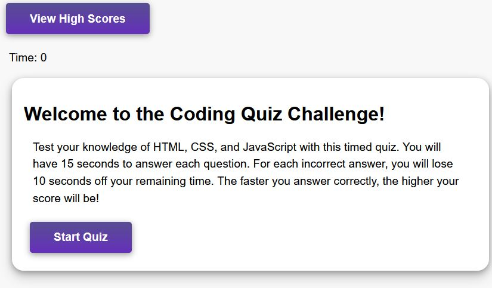

# Quiz Challenge

Welcome to the JavaScript quiz, a tool designed to help coding boot camp students test their understanding of fundamental concepts in JavaScript. This quiz is specifically tailored to provide a challenging but enjoyable experience, providing students with an opportunity to gauge their progress and identify areas where they need to improve.

The quiz is timed and provides a fair and competitive environment where students can store high scores and compare them to their peers.

With this feature, students can not only test their knowledge of JavaScript concepts, but also measure their proficiency and understanding compared to others in their class.

## Technologies Used

This quiz was created using HTML, CSS, and JavaScript.

## Requirements

GitHub 🐱

Your preferred browser 🌍

Basic coding knowledge 📖

## Credits

Fabrizio Treviño

## Deployed Links

[GitHub Pages](https://fabri-tech.github.io/Fabrizio-Trevino-Quiz-Challenge/)

[GitHub Repository](https://github.com/Fabri-Tech/Fabrizio-Trevino-Quiz-Challenge)
